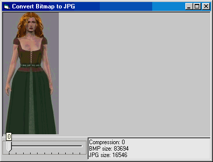



## Dynamic JPG Compressor

### Description

Converts BMP to JPG 'on the fly' and lets you view the result on-screen. Source code for the DLL included.
 
### More Info
 

             |
---                |---
**Submitted On**   |2001-10-31 10:41:16
**By**             |[Kamilche](https://github.com/Planet-Source-Code/PSCIndex/blob/master/ByAuthor/kamilche.md)
**Level**          |Beginner
**User Rating**    |3.7 (26 globes from 7 users)
**Compatibility**  |VB 5\.0, VB 6\.0
**Category**       |[Graphics](https://github.com/Planet-Source-Code/PSCIndex/blob/master/ByCategory/graphics__1-46.md)
**World**          |[Visual Basic](https://github.com/Planet-Source-Code/PSCIndex/blob/master/ByWorld/visual-basic.md)
**Archive File**   |[Dynamic JP3228610312001\.zip](https://github.com/Planet-Source-Code/kamilche-dynamic-jpg-compressor__1-28551/archive/master.zip)

